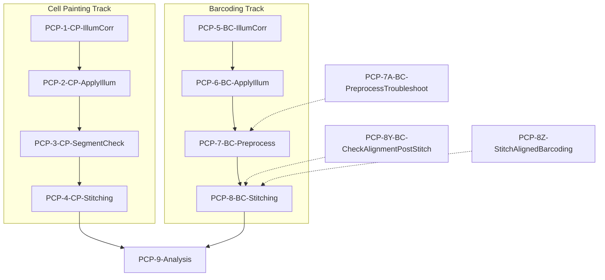

# CellProfiler Pipelines and AWS Lambda Orchestration for Pooled Cell Painting

This document provides a comprehensive explanation of both the CellProfiler pipelines and the AWS Lambda functions that orchestrate them in the Pooled Cell Painting image processing workflow. It includes detailed information on pipeline implementations, Lambda function patterns, configuration parameters, and complete experiment setup instructions.

> **Note:** For a high-level overview of the system architecture and component relationships, see the companion document [Technical_Implementation_Overview.md](./Technical_Implementation_Overview.md).

## Overview

The image processing workflow consists of two parallel tracks followed by a combined analysis:

1. **Cell Painting Processing** (Pipelines 1-4)
2. **Barcoding Processing** (Pipelines 5-8)
3. **Combined Analysis** (Pipeline 9)

Each pipeline is launched by a corresponding AWS Lambda function that configures input/output paths, prepares metadata, and creates CSV files to drive the CellProfiler analysis.


The diagram above illustrates the complete workflow with both Cell Painting (top row) and Barcoding (middle row) image processing tracks, followed by the combined analysis step. The pipeline numbers correspond to the CellProfiler pipelines described in this document.

The workflow is orchestrated by AWS Lambda functions, with each function responsible for a specific pipeline stage. These Lambda functions serve as the automation backbone that coordinates pipeline execution, handles configuration, and manages the processing of thousands of images across AWS resources.

## Lambda Function Architecture and Implementation

### Pipeline Flow and Triggers



Each pipeline in the workflow is orchestrated by a corresponding AWS Lambda function (PCP-1 through PCP-9). These Lambda functions automate the pipeline execution and handle the transition of data between stages in a sequential workflow:

1. The workflow begins with two parallel tracks: cell painting processing (PCP-1 through PCP-4) and barcoding processing (PCP-5 through PCP-8)
2. Each Lambda function is triggered by the output of the previous step (typically a file upload to S3)
3. For example, PCP-1-CP-IllumCorr is triggered by the upload of the 1_CP_Illum.cppipe file, and produces illumination function files that then trigger PCP-2-CP-ApplyIllum
4. The final Lambda function (PCP-9-Analysis) integrates the outputs from both tracks for comprehensive analysis

### Lambda Function Implementation Pattern

All Lambda functions in the workflow follow a common implementation pattern:

1. **Trigger Processing**: Responds to S3 event or manual invocation
   - Lambda's `lambda_handler` function is the entry point
   - For S3 triggers: `event["Records"][0]["s3"]["object"]["key"]` extracts the triggering file path
   - For manual triggers (like PCP-9-Analysis): Empty event object is passed with hardcoded parameters

2. **Configuration Loading**: 
   - Loads experiment configuration from metadata.json using `download_and_read_metadata_file()`
   - Contains pipeline-specific AWS resource requirements in `config_dict`
   - May check if previous step's completion using `check_if_run_done()`

3. **Pipeline Selection and Plate Filtering**:
   - Selects appropriate pipeline variant based on experiment configuration
   ```python
   # Example from PCP-1-CP-IllumCorr
   if len(Channeldict.keys()) == 1:  # Standard experiment
       pipeline_name = "1_CP_Illum.cppipe"
   if len(Channeldict.keys()) > 1:   # SABER experiment
       pipeline_name = "1_SABER_CP_Illum.cppipe"
   ```
   - Applies optional plate inclusion/exclusion filters

4. **Input Discovery and CSV Generation**:
   - Uses `paginate_a_folder()` to list all input files efficiently
   - Parses image names using `parse_image_names()` to extract metadata (wells, sites, channels)
   - Creates pipeline-specific CSV file using the appropriate `create_CSV_pipeline*()` function
   - Uploads the generated CSV to S3 for the CellProfiler pipeline to consume

5. **AWS EC2 Job Configuration and Execution**:
   - Sets up AWS environment with `run_setup()`
   - Configures batch jobs with the pipeline-specific `create_batch_jobs_*()` function
   - Launches EC2 instances with Docker containers via `run_cluster()`
   - Sets up job completion monitoring with `run_monitor()`

### Key Utility Functions

Each Lambda function relies on a common set of utility modules:

#### From helpful_functions.py:
- **download_and_read_metadata_file()**: Retrieves and parses experiment configuration
- **paginate_a_folder()**: Lists S3 objects with pagination for large image sets
- **parse_image_names()**: Extracts metadata from image filenames
- **write_metadata_file()**: Updates metadata with processing results
- **check_if_run_done()**: Validates job completion status

#### From create_CSVs.py:
- **create_CSV_pipelineN()**: Pipeline-specific CSV generators
- Each translates experiment parameters into CellProfiler-compatible format
- Handles different acquisition modes (fast/slow, one/many files)

#### From run_DCP.py and create_batch_jobs.py:
- Functions for creating and monitoring AWS EC2 jobs
- Configures EC2 instances based on pipeline requirements
- Handles container setup and execution

## Pipeline Configuration System

This section details the configuration parameters and settings needed to set up the CellProfiler pipelines for Pooled Cell Painting experiments.

> **Note:** For the architectural overview of the configuration system and its role in the overall workflow, see the [Multi-Layered Configuration Architecture section in the Technical Implementation Overview](./Technical_Implementation_Overview.md#4-multi-layered-configuration-architecture).

### Multi-layered Configuration Architecture

The system employs a three-tiered configuration approach that separates experimental, computational, and infrastructure concerns. This separation allows independent modification of experimental parameters, resource allocation, and AWS infrastructure without requiring wholesale redesign of the system.


#### Configuration Layer Relationships

Each layer serves a distinct purpose in the overall system:

- **Experiment Configuration** (metadata.json): Controls WHAT data is processed and HOW it's processed
- **Computing Resource Configuration** (Lambda config_dict): Specifies HOW MUCH computing power is allocated and WHEN jobs are considered complete
- **Infrastructure Configuration** (AWS config files): Determines WHERE in AWS the processing happens

### Detailed Configuration Parameters

#### 1. Experiment Configuration (metadata.json)

The `metadata.json` file (based on `configs/metadatatemplate.json`) defines all experiment-specific parameters:

##### Image Grid Configuration
- `painting_rows`, `painting_columns`: Define cell painting image layout for square acquisitions
- `painting_imperwell`: Defines total images per well for circular acquisitions (overrides rows/columns)
- `barcoding_rows`, `barcoding_columns`: Define barcoding image layout for square acquisitions
- `barcoding_imperwell`: Defines total images per well for circular acquisitions (overrides rows/columns)
- Note: Use rows/columns for square acquisition patterns; use imperwell for circular acquisition patterns

##### Channel Dictionary Configuration
```json
"Channeldict":"{'round0':{'DAPI':['DNA_round0',0], 'GFP':['Phalloidin',1]}, 'round1':{'DAPI':['DNA_round1',0],'GFP':['GM130',1], ...}}"
```
- Maps microscope channel names to biological stains and frame indices
- For multiple rounds (SABER) experiments:
  - Keys are the folder names of the rounds (e.g., '20X_c0-SABER-0', '20X_c1-SABER-1')
  - Common stains between rounds should include round identifiers (e.g., 'DNA_round0', 'DNA_round1')
  - Example: 
    ```json
    "Channeldict":"{'20X_c0-SABER-0':{'DAPI':['DNA_round0',0], 'GFP':['Phalloidin',1]}, '20X_c1-SABER-1':{'DAPI':['DNA_round1',0],'GFP':['GM130',1], 'A594':['Tubulin',2], 'Cy5':['Calnexin', 3]}, '20X_c2-SABER-2':{'DAPI':['DNA_round2',0],'GFP':['COX-IV',1], 'A594':['TDP-43',2], 'Cy5':['G3BP1',3], '750':['LAMP1',4]}}"
    ```
- For single-round experiments:
  - Single key matching the Cell Painting folder name (typically '20X_CP')
  - Example: 
    ```json
    "Channeldict":"{'20X_CP':{'DAPI':['DNA', 0], 'GFP':['Phalloidin',1], 'A594':['Mito',2], 'Cy5':['ER',3], '750':['WGA',4]}}"
    ```
- First value in each array is the stain name, second is the frame index (0-based)
- Used to determine the pipeline variant (SABER vs. standard)

##### Processing Configuration
- `one_or_many_files`: Controls if each well is stored as a single file (`"one"`) or multiple files (`"many"`)
  - Should be locked to `"many"` for production runs
- `fast_or_slow_mode`: Determines CSV generation strategy and processing path
  - Should be locked to `"slow"` for production runs
- `barcoding_cycles`: Sets the number of barcoding cycles to process
- `range_skip`: Sets sampling frequency for Pipeline 3 (SegmentCheck), to process subset of images for validation
  - Typically doesn't need to be changed from default

##### Stitching Configuration
- `overlap_pct`: Controls image overlap percentage between adjacent fields
- `stitchorder`: Specifies tile arrangement
  - For square acquisitions: "Grid: snake by rows" or "Grid: row-by-row"
  - For round acquisitions: "Filename defined position"
- `tileperside`: Number of tiles along each side of the stitched image grid
  - Typically doesn't need to be changed from default
- `final_tile_size`: Pixel dimensions of each output tile after cropping
  - Typically doesn't need to be changed from default
- `round_or_square`: Shape of the well for cropping calculations (`"round"` or `"square"`)
- `quarter_if_round`: Whether to divide round wells into quarters for processing (`"True"` or `"False"`)
- `*_xoffset_tiles`, `*_yoffset_tiles`: Optional offsets for troubleshooting stitching misalignments
  - Should be 0 unless troubleshooting gross stitching misalignments
- `compress`: Whether to compress output files (`"True"` or `"False"`)
  - Should be set to `"True"` to save out compressed files from stitch-crop pipelines

#### 2. Computing Resource Configuration (Lambda config_dict)

Each Lambda function contains a specific `config_dict` with pipeline-appropriate settings:

```python
config_dict = {
    "APP_NAME": "2018_11_20_Periscope_X_IllumPainting",
    "DOCKERHUB_TAG": "cellprofiler/distributed-cellprofiler:2.0.0_4.2.1",
    "TASKS_PER_MACHINE": "1",
    "MACHINE_TYPE": ["c5.xlarge"],
    "MEMORY": "7500",
    "DOCKER_CORES": "4",
    "CHECK_IF_DONE_BOOL": "True",
    "EXPECTED_NUMBER_FILES": "5",  # Varies by pipeline
    # Additional parameters...
}
```

The key parameters that need configuration for each pipeline are:
- **APP_NAME**: Unique identifier for the specific experiment
- **MACHINE_TYPE**: EC2 instance type appropriate for the pipeline's computational needs
- **MEMORY**: RAM allocation for the Docker container
- **EXPECTED_NUMBER_FILES**: Number of output files to expect
- **CHECK_IF_DONE_BOOL**: Controls validation of job completion

#### 3. Pipeline-Specific CSV Configuration

Each pipeline is driven by a CSV file with a specific structure generated by functions in `create_CSVs.py`:

| Pipeline                      | CSV Generator Function    | Key Columns                                     | Special Considerations                                |
| ----------------------------- | ------------------------- | ----------------------------------------------- | ----------------------------------------------------- |
| 1: CP-Illum                   | `create_CSV_pipeline1()`  | FileName_Orig*, PathName_Orig*, Frame_Orig*     | Generates two CSVs (for pipelines 1 & 2)              |
| 2: CP-ApplyIllum              | (generated by pipeline1)  | PathName_Illum*, FileName_Illum*, Metadata_Well | Adds well metadata for organization                   |
| 3: SegmentCheck               | `create_CSV_pipeline3()`  | PathName_DNA, FileName_DNA, Metadata_Well       | Uses range_skip parameter for subset processing       |
| 4: CP-Stitching               | (external FIJI script)    | (uses file system patterns)                     | Not CSV-driven; uses FIJI for image stitching         |
| 5: BC-Illum                   | `create_CSV_pipeline5()`  | Metadata_SBSCycle, PathName_Orig*, Series_Orig* | Mode-dependent structure (fast/slow)                  |
| 6: BC-ApplyIllum              | `create_CSV_pipeline6()`  | Cycle*_Orig*, Cycle*_Illum*, PathName_Cycle*    | Complex multi-cycle column structure                  |
| 7: BC-Preprocess              | `create_CSV_pipeline7()`  | PathName_Cycle*, FileName_Cycle*                | Cycle-indexed structure with DAPI from Cycle01        |
| 7A: BC-PreprocessTroubleshoot | (uses pipeline7 CSV)      | (same as pipeline7)                             | Uses same CSV structure as pipeline7 with diagnostics |
| 8: BC-Stitching               | (external FIJI script)    | (uses file system patterns)                     | Not CSV-driven; uses FIJI for barcoding stitching     |
| 8Y: BC-CheckAlignment         | `create_CSV_pipeline8Y()` | PathName_Cycle01_DAPI, PathName_CorrDNA         | Cross-references painting and barcoding images        |
| 9: Analysis                   | `create_CSV_pipeline9()`  | CP_Corr* and Cycle*_* columns                   | Most complex CSV - integrates all imaging data types  |

The CSV files translate configuration parameters into CellProfiler-compatible format using:
- **FileName_X** and **PathName_X** columns for each channel (essential for LoadData module)
- **Metadata_X** columns for grouping and organization (Plate, Well, Site)
- **Frame_X** and **Series_X** columns for multi-channel files in fast mode
- **Cycle**-prefixed columns for barcoding data (Cycle01, Cycle02, etc.)
- **_Orig** suffix for raw images and **_Illum** suffix for illumination files
- **_Corr** suffix for corrected images that have had illumination applied

## Cell Painting Processing Pipelines

### Pipeline 1: Cell Painting Illumination Correction (1_CP_Illum.cppipe)

**Purpose**: Calculate per-plate illumination correction functions for each cell painting channel

**Lambda Function**: `PCP-1-CP-IllumCorr`
- **Trigger**: S3 upload of 1_CP_Illum.cppipe
- **CSV Generator**: `create_CSV_pipeline1()`
- **Output**: Illumination function files (.npy)

**Key Operations**:
1. Loads raw images via CSV configuration
2. For each channel (DNA, ER, Phalloidin, Mito, WGA):
   - Downsample images to 25% size for faster processing
   - Calculate illumination function across all images using median filtering
   - Upsample correction back to original size
3. Save correction functions as .npy files with naming convention: `{Plate}_Illum{Channel}.npy`

### Pipeline 2: Cell Painting Illumination Application (2_CP_Apply_Illum.cppipe)

**Purpose**: Apply illumination correction and segment cells for quality control

**Lambda Function**: `PCP-2-CP-ApplyIllum`
- **Trigger**: S3 upload of IllumMito.npy (output from Pipeline 1)
- **CSV Generator**: Created by `create_CSV_pipeline1()` (generates two CSVs at once)
- **Output**: Corrected cell images (.tiff) and segmentation parameters

**Key Operations**:
1. Apply illumination correction to all channels via division method
2. Identify confluent regions to mask out problem areas
3. Segment nuclei in DNA channel (10-80 pixel diameter)
4. Identify cell boundaries from nuclei using watershed segmentation
5. Export segmentation thresholds for quality control
6. Save corrected images as TIFF files

**Configuration Details**:
- Segmentation thresholds are automatically calculated and stored for Pipeline 3

### Pipeline 3: Cell Painting Segmentation Check (3_CP_SegmentationCheck.cppipe)

**Purpose**: Verify segmentation quality on a subset of images

**Lambda Function**: `PCP-3-CP-SegmentCheck`
- **Trigger**: S3 upload of PaintingIllumApplication_Image.csv (from Pipeline 2)
- **CSV Generator**: `create_CSV_pipeline3()`
- **Output**: Quality control overlay images showing segmentation

**Key Operations**:
1. Load a subset of corrected images (skipping some sites per Lambda configuration)
2. Apply segmentation using min/max thresholds from Pipeline 2
3. Create color overlay images showing segmentation results
4. Export metrics to validate segmentation quality

**Configuration Details**:
- Uses `range_skip` parameter to process only a subset of images
- Lambda reads segmentation thresholds from Pipeline 2 output

### Pipeline 4: Cell Painting Stitching and Cropping

**Purpose**: Stitch field-of-view images into whole-well montages and create manageable tiles

**Lambda Function**: `PCP-4-CP-Stitching`
- **Trigger**: S3 upload of SegmentationCheck_Experiment.csv (from Pipeline 3)
- **Implementation**: Uses FIJI scripts rather than CellProfiler
- **Output**: Stitched and cropped cell painting images

**Key Operations**:
1. Stitch multiple fields of view into single whole-well image
2. Generate a smaller (10x) version for preview
3. Crop stitched image into standardized tiles
4. Save output in tiered directory structure by batch and well

## Barcoding Processing Pipelines

### Pipeline 5: Barcoding Illumination Correction (5_BC_Illum.cppipe)

**Purpose**: Calculate illumination correction for barcoding images in each cycle

**Lambda Function**: `PCP-5-BC-IllumCorr`
- **Trigger**: S3 upload of 5_BC_Illum.cppipe
- **CSV Generator**: `create_CSV_pipeline5()`
- **Output**: Cycle-specific illumination function files (.npy)

**Key Operations**:
1. Load barcoding images from all cycles
2. For each channel (DNA, A, C, G, T) in each cycle and plate:
   - Downsample for faster processing
   - Calculate illumination function with cycle-specific and plate-specific correction
   - Upsample back to original size
3. Save per-cycle, per-channel, per-plate correction functions

### Pipeline 6: Barcoding Illumination Application (6_BC_Apply_Illum.cppipe)

**Purpose**: Apply illumination correction and align images across channels and cycles

**Lambda Function**: `PCP-6-BC-ApplyIllum`
- **Trigger**: S3 upload of Cycle1_IllumA.npy (from Pipeline 5)
- **CSV Generator**: `create_CSV_pipeline6()`
- **Output**: Aligned barcoding images

**Key Operations**:
1. Apply illumination correction by channel, cycle, and plate
2. Note: No longer supports "fast mode" alignment of A, C, G, T channels to DAPI within each cycle as it did not work well enough
3. Align all cycle DAPI images to Cycle 1 DAPI
4. Shift A, C, G, T channels by same amount as their DAPI image
5. Save corrected and aligned images

### Pipeline 7: Barcoding Preprocessing (7_BC_Preprocess.cppipe)

**Purpose**: Process aligned barcoding images to identify and characterize barcode foci

**Lambda Function**: `PCP-7-BC-Preprocess`
- **Trigger**: S3 upload of BarcodingApplication_Experiment.csv (from Pipeline 6)
- **CSV Generator**: `create_CSV_pipeline7()`
- **Output**: Processed barcoding images with foci identification

**Key Operations**:
1. Perform per-image illumination correction grouped by cycle
2. Identify nuclei using the DAPI channel (cells are not identified)
3. Identify potential barcode foci in each channel
4. The CompensateColors module includes many configurable parameters including:
   - Histogram matching (optional)
   - Channel compensation to correct for spectral bleed-through
   - Rescaling foci intensities (optional)
5. Analyze foci intensities and call barcodes
6. Create composite images for QC visualization

### Pipeline 8: Barcoding Stitching and Cropping

**Purpose**: Stitch and crop barcoding images similar to cell painting images

**Lambda Function**: `PCP-8-BC-Stitching`
- **Trigger**: S3 upload of BarcodePreprocessing_Experiment.csv (from Pipeline 7)
- **Implementation**: Uses FIJI scripts rather than CellProfiler
- **Output**: Stitched barcoding images

**Key Operations**:
1. Similar to Pipeline 4, but operates on barcoding images
2. Stitches according to same grid layout as cell painting
3. Produces consistent tile naming for alignment with cell painting tiles

## Final Analysis Pipeline

### Pipeline 9: Analysis (9_Analysis.cppipe)

**Purpose**: Integrate cell painting and barcoding data for downstream analysis

**Lambda Function**: `PCP-9-Analysis`
- **Trigger**: Manual trigger (triggered after both tracks complete)
- **CSV Generator**: `create_CSV_pipeline9()`
- **Output**: Integrated analysis results and segmentation masks

**Key Operations**:
1. Align cell painting images to barcoding images using DAPI channels
2. Identify and mask overly-confluent regions
3. Segment nuclei, cells, cytoplasm in cell painting images
4. Locate barcode foci in aligned images
5. Measure cell painting features across all compartments
6. Call barcodes and annotate quality metrics
7. Filter objects into quality categories (Perfect, Great, Empty, etc.) FIXME: Does this happen? Beth says maybe no longer
8. Export segmentation masks and merged, annotated images for visualization

## Special-Purpose Pipelines

In addition to the main pipeline sequence, there are specialized pipelines for troubleshooting:

### 7A_BC_Preprocess_Troubleshooting.cppipe

**Purpose**: Specialized version of Pipeline 7 with additional diagnostics

**Lambda Function**: `PCP-7A-BC-PreprocessTroubleshoot`
- **Trigger**: Manual trigger for troubleshooting
- **Output**: Diagnostic images and measurements

**Key Differences**:
- Includes additional QC measurements
- Outputs more diagnostic images
- May use alternative image processing parameters
- Used when standard pipeline produces unexpected results

### 6_BC_Apply_Illum_DebrisMask.cppipe

**Purpose**: Alternative version of Pipeline 6 that identifies and masks debris

**Key Differences**:
- Adds debris identification and masking
- Prevents debris from interfering with alignment
- Used for samples with high debris content

### 8Y_CheckAlignmentPostStitching

**Purpose**: Validate alignment between stitched Cell Painting and Barcoding images

**Lambda Function**: `PCP-8Y-BC-CheckAlignmentPostStitch`
- **Trigger**: Manual trigger or after completion of Pipelines 4 and 8
- **CSV Generator**: `create_CSV_pipeline8Y()`
- **Implementation**: Uses CellProfiler pipeline for alignment validation
- **Output**: Alignment validation images and metrics

**Key Operations**:
1. Takes the stitched Cell Painting DNA images and Cycle01 DAPI images from Barcoding
2. Cross-references these images to validate their alignment
3. Produces diagnostic images showing alignment quality
4. Identifies any systematic misalignments that may need adjustment in the metadata

**Configuration Details**:
- Uses the `Cycle01_DAPI` channel from barcoding as the reference
- Compares with `CorrDNA` from Cell Painting track
- Creates a CSV that links corresponding tiles from both imaging modalities
- Runs on a site-by-site basis for detailed validation

### 8Z_StitchAlignedBarcoding

**Purpose**: Stitch and crop barcoding images from the aligned images directory instead of the corrected images directory

**Lambda Function**: `PCP-8Z-StitchAlignedBarcoding`
- **Trigger**: Manual trigger, typically after alignment issues are discovered
- **Implementation**: Uses the same FIJI script as Pipeline 8 but on different inputs
- **Output**: Stitched and cropped barcoding images from aligned sources

**Key Operations**:
1. Similar to Pipeline 8, but takes input from the `images_aligned` directory instead of `images_corrected`
2. Uses the FIJI stitching script to create stitched whole-well images
3. Also creates a smaller (10x) version for preview and visualization
4. Crops stitched images into standardized tiles for downstream analysis
5. Handles both square and round wells using the same configurable parameters as Pipeline 8

**Configuration Details**:
- Uses identical configuration parameters to Pipeline 8
- Allows separate adjustment of x/y offset tiles through metadata
- Supports compression of output images when configured
- Can divide round wells into quarters for more manageable processing

## Pipeline-Specific Implementation Details

This section explains how CellProfiler pipelines interact with the configuration system and detailed implementation considerations for each pipeline step.

> **Note:** For the architectural view of how configuration layers interact within the overall system, see the [Workflow Architecture section in the Technical Implementation Overview](./Technical_Implementation_Overview.md#workflow-architecture).

### Pipeline Variant Selection

Lambda functions select specific pipeline variants based on experimental configuration:

```python
# Sample code from PCP-1-CP-IllumCorr
if len(Channeldict.keys()) == 1:  # Standard experiment
    pipeline_name = "1_CP_Illum.cppipe"
if len(Channeldict.keys()) > 1:   # SABER experiment
    pipeline_name = "1_SABER_CP_Illum.cppipe"
```

This dynamic selection allows the same Lambda function to handle different experimental designs without code changes.

### CSV Generation Implementation

Each pipeline stage has a specialized CSV generator function that translates metadata parameters into CellProfiler-compatible input:

1. **Channel Dictionary Parsing**:
   ```python
   # From create_CSV_pipeline1()
   Channeldict = ast.literal_eval(Channeldict)
   rounddict = {}
   Channelrounds = list(Channeldict.keys())
   for eachround in Channelrounds:
       templist = []
       templist += Channeldict[eachround].values()
       channels += list(i[0] for i in templist)
   ```

2. **Acquisition Mode Handling**:
   ```python
   # From create_CSV_pipeline6()
   if one_or_many == "one" and fast_or_slow == "fast":
       # One file structure
   elif one_or_many == "many" and fast_or_slow == "slow":
       # Many file structure
   ```

3. **Cycle-Aware Configuration**:
   ```python
   # From create_CSV_pipeline7()
   for cycle in range(1, (expected_cycles + 1)):
       this_cycle = "Cycle%02d_" % cycle
       # Configure cycle-specific columns
   ```

### CellProfiler Pipeline Parameterization

CellProfiler pipelines are parameterized through CSV columns that control their behavior:

1. **Metadata Grouping**: Controls how images are processed together
   ```
   Group images by metadata?:Yes
   Select metadata tags for grouping:Plate
   ```

2. **Channel Selection**: Driven by metadata-derived CSV columns
   ```
   Select the input image:OrigDNA  # Comes from CSV FileName_OrigDNA column
   ```

3. **Output Naming**: Uses metadata variables from the CSV
   ```
   Enter single file name:\g<Plate>_IllumDNA  # \g<> syntax references metadata
   ```

This parameterization approach enables the same pipeline code to process different experimental designs based on the configuration-derived CSV input.
