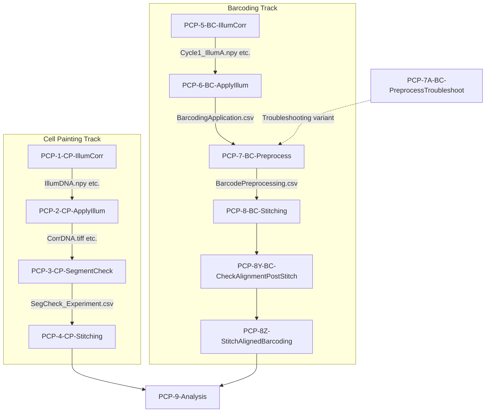
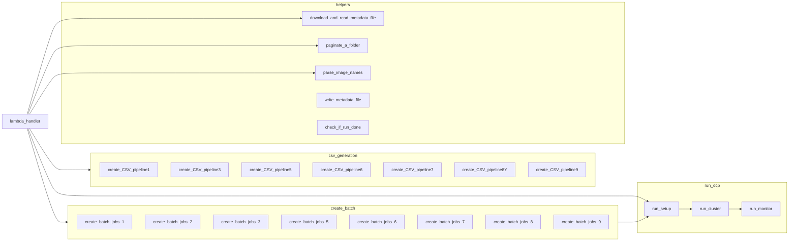
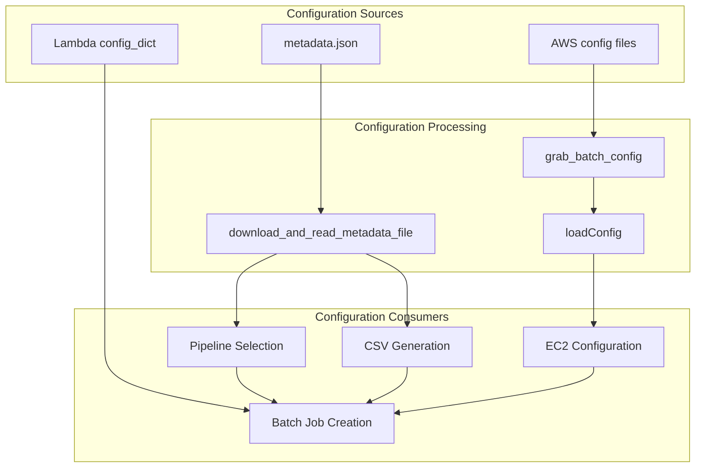

# Lambda Functions Overview for Pooled Cell Painting Pipeline

> **Note:** This document provides detailed technical information about the Lambda function implementation used in the Pooled Cell Painting workflow. For information about the CellProfiler pipelines and higher-level workflow, see [CellProfiler_Pipeline_Details.md](./CellProfiler_Pipeline_Details.md).

## Lambda Function Configuration

Each Lambda function contains a specific `config_dict` with pipeline-appropriate settings:

```python
config_dict = {
    "APP_NAME": "2018_11_20_Periscope_X_IllumPainting",
    "DOCKERHUB_TAG": "cellprofiler/distributed-cellprofiler:2.0.0_4.2.1",
    "TASKS_PER_MACHINE": "1",
    "MACHINE_TYPE": ["c5.xlarge"],
    "MEMORY": "7500",
    "DOCKER_CORES": "4",
    "CHECK_IF_DONE_BOOL": "True",
    "EXPECTED_NUMBER_FILES": "5",  # Varies by pipeline
    # Additional parameters...
}
```

The key parameters that need configuration for each pipeline are:
- **APP_NAME**: Unique identifier for the specific experiment
- **MACHINE_TYPE**: EC2 instance type appropriate for the pipeline's computational needs
- **MEMORY**: RAM allocation for the Docker container
- **EXPECTED_NUMBER_FILES**: Number of output files to expect from each pipeline stage
- **CHECK_IF_DONE_BOOL**: Whether to validate job completion

These parameters control the AWS resources allocated to run each CellProfiler pipeline.

## Pipeline Flow Diagram



## Lambda Function Call Dependencies

Based on `lambda_flow.gv` analysis, each Lambda function uses a common set of utility functions in a consistent pattern:



## Lambda Function Details

| Lambda Function | Trigger Event | Pipeline Used | Primary Output | Core Function |
|-----------------|---------------|--------------|----------------|---------------|
| **PCP-1-CP-IllumCorr** | S3 upload of pipeline | 1_CP_Illum.cppipe | Illumination functions (.npy) | Calculate correction functions for cell images |
| **PCP-2-CP-ApplyIllum** | S3 upload of IllumMito.npy | 2_CP_Apply_Illum.cppipe | Corrected cell images (.tiff) | Apply illumination correction to cell images |
| **PCP-3-CP-SegmentCheck** | CSV file upload | 3_CP_SegmentationCheck.cppipe | QC images | Validate segmentation quality |
| **PCP-4-CP-Stitching** | CSV file upload | (FIJI scripts) | Stitched cell images | Stitch FOVs into whole well images |
| **PCP-5-BC-IllumCorr** | S3 upload of pipeline | 5_BC_Illum.cppipe | Illumination functions (.npy) | Calculate correction for barcoding images |
| **PCP-6-BC-ApplyIllum** | S3 upload of Cycle1_IllumA.npy | 6_BC_Apply_Illum.cppipe | Aligned images | Apply correction and align barcoding images |
| **PCP-7-BC-Preprocess** | CSV file upload | 7_BC_Preprocess.cppipe | Processed barcoding images | Process and identify barcodes |
| **PCP-7A-BC-PreprocessTroubleshoot** | Manual trigger | 7A_BC_Preprocess_Troubleshooting.cppipe | Diagnostic outputs | Troubleshoot preprocessing issues |
| **PCP-8-BC-Stitching** | CSV file upload | (FIJI scripts) | Stitched barcoding images | Stitch barcoding images |
| **PCP-8Y-BC-CheckAlignmentPostStitch** | S3 file creation | Custom check scripts | Alignment validation | Check alignment after stitching |
| **PCP-8Z-StitchAlignedBarcoding** | S3 file upload | Custom stitching scripts | Final aligned stitches | Final barcoding image alignment |
| **PCP-9-Analysis** | Manual trigger | 9_Analysis.cppipe | Analysis results | Integrate cell painting and barcoding data |

## Lambda Function Implementation Pattern

Based on the `lambda_flow.gv` analysis, the Lambda functions share a common implementation pattern:

1. **Trigger**: Responds to S3 event or manual invocation
   - Each Lambda's `lambda_handler` function serves as the entry point
   - S3 event trigger pattern: `event["Records"][0]["s3"]["object"]["key"]`

2. **Configuration**: 
   - Loads metadata.json via `helpful_functions.download_and_read_metadata_file()`
   - Uses internal `config_dict` for AWS resources
   - Determines pipeline variant based on metadata (e.g., SABER vs. standard)
   ```python
   if len(Channeldict.keys()) == 1:  # Standard experiment
       pipeline_name = "1_CP_Illum.cppipe"
   if len(Channeldict.keys()) > 1:   # SABER experiment
       pipeline_name = "1_SABER_CP_Illum.cppipe"
   ```

3. **Input Processing**:
   - Lists images via `helpful_functions.paginate_a_folder()`
   - Parses images using `helpful_functions.parse_image_names()`
   - Creates pipeline-specific CSV files using appropriate `create_CSVs.create_CSV_pipeline*()`

4. **Job Execution**:
   - Initializes AWS applications via `run_DCP.run_setup()`
   - Calls specific `create_batch_jobs.create_batch_jobs_*()` function
   - Launches EC2 cluster via `run_DCP.run_cluster()`

5. **Monitoring**:
   - Sets up monitoring via `run_DCP.run_monitor()`
   - All Lambda functions converge on the same monitoring approach

## Key Utility Functions

The `lambda_flow.gv` analysis reveals key shared functions across all Lambda functions:

### From helpful_functions.py:
- **download_and_read_metadata_file()**: Downloads and parses metadata.json
- **paginate_a_folder()**: Lists S3 objects with pagination
- **parse_image_names()**: Parses raw image names into structured data
- **write_metadata_file()**: Updates metadata with processed information
- **check_if_run_done()**: Validates job completion

### From create_CSVs.py:
- **create_CSV_pipeline1()** through **create_CSV_pipeline9()**: Generate pipeline-specific CSV files
- Each CSV generator handles a different pipeline stage's requirements
- Contains logic for translating metadata parameters to CellProfiler-compatible formats

### From run_DCP.py:
- **run_setup()**: Initializes AWS application configuration
- **run_cluster()**: Configures and launches EC2 instances
- **run_monitor()**: Sets up completion monitoring
- **grab_batch_config()**: Retrieves stage-specific AWS configuration

### From create_batch_jobs.py:
- **create_batch_jobs_1()** through **create_batch_jobs_9()**: Configure AWS Batch jobs
- Each function is specialized for a specific pipeline stage's requirements
- All rely on a shared JobQueue class for scheduling

## Configuration Dependence

The `lambda_flow.gv` analysis shows how configuration flows through the pipeline:



Each Lambda function's behavior is shaped by these configuration layers:

1. **metadata.json**: Experimental parameters
   - Loaded via `download_and_read_metadata_file()`
   - Directly influences pipeline selection
   - Controls CSV generation parameters
   - Determines how many images are expected

2. **Lambda config_dict**: AWS resource allocation
   - Embedded in each Lambda function's code
   - Defines AWS Batch resource allocation
   - Sets monitoring parameters
   - Controls Docker container selection

3. **AWS config files**: Infrastructure configuration
   - Loaded via `grab_batch_config()` and `grab_fleet_file()`
   - Defines networking and security settings
   - Configures EC2 instance types and AMIs
   - Sets up IAM roles and policies